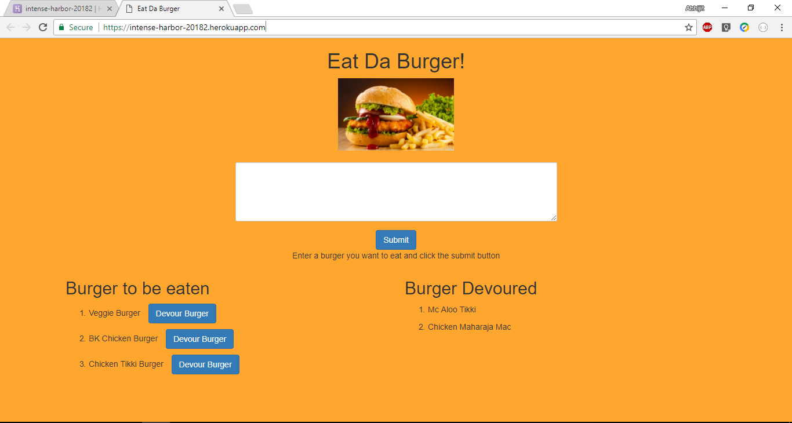
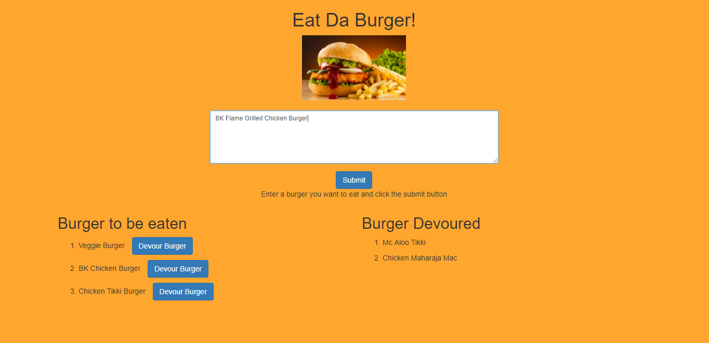
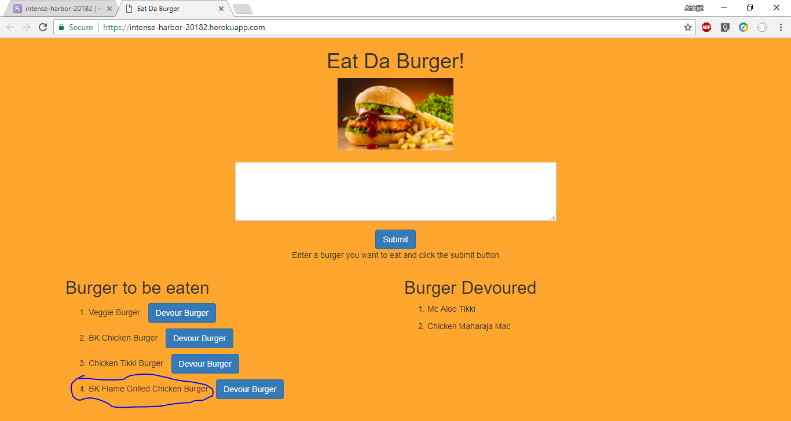
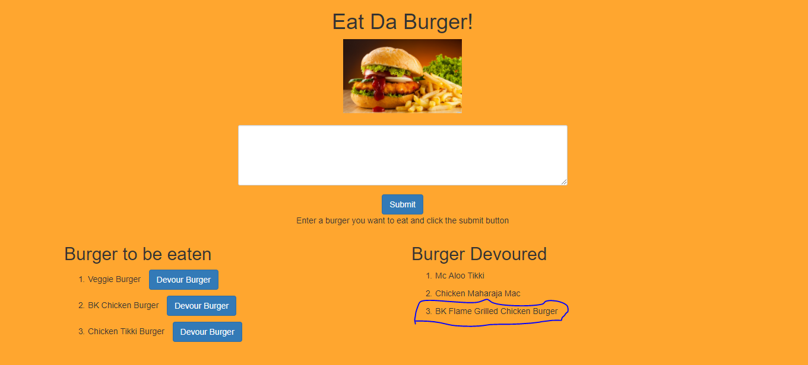

# Eat Da Burger

Eat Da Burger is a Full stack web application which has been built using following:

The app has been designed using the MVC software Architecture.

* Front End: Handlebars, CSS, Javascript, Jquery
* Serverside: node.js, Express.js
* Database: Mysql

The Application is hosted on Heroku: https://intense-harbor-20182.herokuapp.com/

## Application Interface:

Eat Da Burger is an Restaurant app that allows the user to order any burger that user wishes. Once done enjoying the burger user can click devour the burger.

* Landing Page

* Enter Burger to be enjoyed 

* Burger is added and waiting to be Devoured

* Burger Devoured!!!!!

